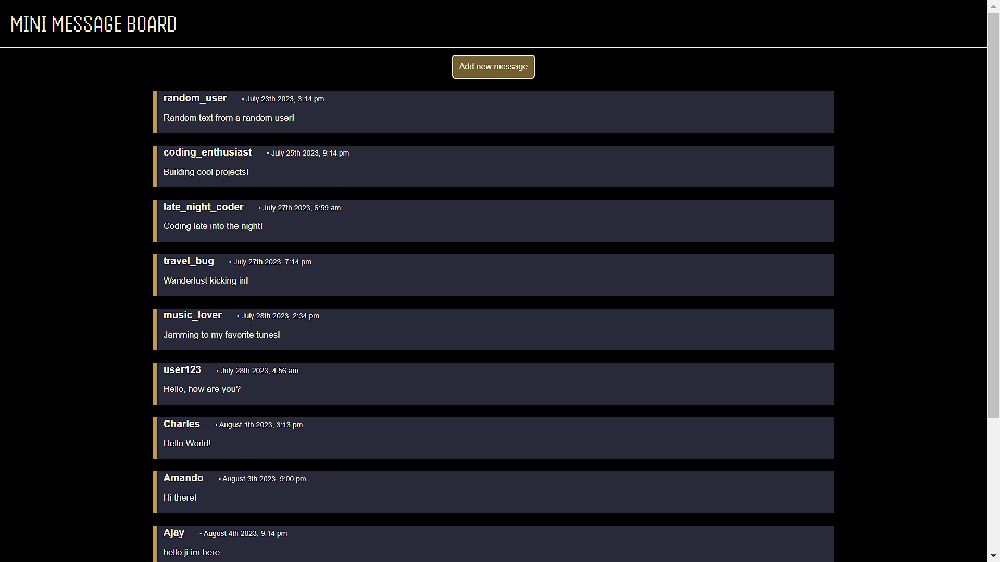
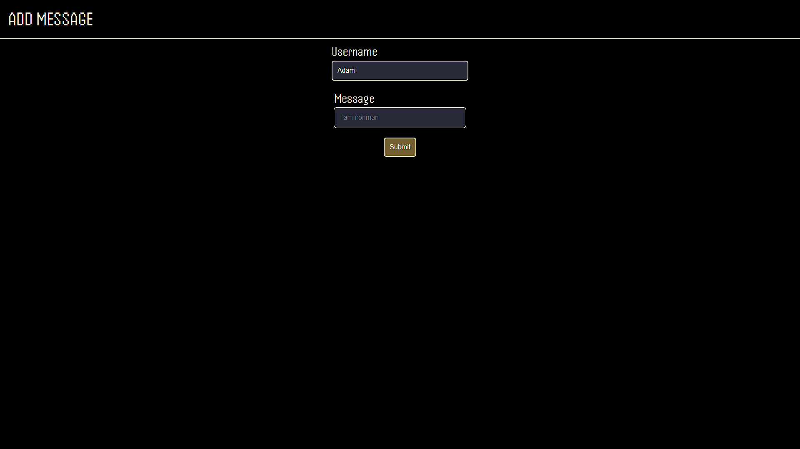

# Mini message board

Mini Message Board is a web-based learning project built with Express.js and MongoDB. It enables users to communicate by posting messages on different topics, providing an interactive platform to learn web development and database integration.

## Demo

[Live Preview](https://mini-message-board-jana.onrender.com)

## Screenshots

## Tech Stack

- NodeJS
- ExpressJS
- EJS
- MongoDB
## Hosting & Deployment

- Render ( Web hosting )
- MongoDB Atlas ( database server )
## Packages

- mongoose
- dotenv
- moment js
- nodemon
- concurrently
